

  

# Home Server Companion

---

---

**Home Server Companion** is a powerful, modern Chrome Extension designed to bring your home server directly to your browser's toolbar. Manage downloads, monitor streams, check requests, and control your server status with a sleek, unified interface.

## ✨ Features

A comprehensive dashboard for your self-hosted services:

- **📦 SABnzbd**:
  - Monitor real-time download queue with speed and time remaining.
  - **Timed Pause**: Pause downloads for 15min, 30min, 1h, 2h, 6h, or indefinitely.
  - Pause/Resume the entire queue or delete individual items.
  - View detailed download history with status indicators.
- **📺 Sonarr**:
  - **Calendar**: View upcoming episodes with air times and release info.
  - **Queue**: Track active downloads with warnings for stuck items.
  - **History**: See recently imported episodes grouped by series and season.
  - **Queue Management**: Delete items with options to remove from client or blocklist & search for alternatives.
  - **Badge Notifications**: Visual alerts for queue issues requiring attention.
- **🎬 Radarr**:
  - **Calendar**: View upcoming movie releases (Digital, Physical, Cinema).
  - **Queue**: Monitor active downloads with issue detection.
  - **History**: Browse recently imported movies with poster art.
  - **Queue Management**: Remove downloads or blocklist releases and trigger automatic re-search.
  - **Badge Notifications**: Alerts for download warnings and errors.
- **📊 Tautulli**:
  - View active Plex streams with rich metadata and poster art.
  - **Kill Stream**: Terminate active streams directly from the popup.
  - **Activity Links**: Click titles or posters to open the media directly in your PMS or Tautulli.
  - **Detailed Stats**: User info, playback quality, bandwidth, stream decision (Direct Play/Transcode).
  - **Expandable Details**: View full stream, player, and user information.
- **✍️ Overseerr**:
  - **Browse Requests**: View and filter requests by status (Pending, Approved, Processing, Available).
  - **Search**: Search TMDB for movies and TV shows to request.
  - **Trending**: Discover trending content with random rotation on each view.
  - **Request Media**: One-click requests for movies and full TV seasons.
  - **Approve/Decline**: Manage pending requests directly from the extension.
  - **Smart Caching**: Instant load times with hydrated request data.
- **⚙️ Unraid**:
  - **System Dashboard**: Real-time CPU ring chart, RAM usage bar, and uptime tracking.
  - **Quick Stats**: Array status and storage space overview.
  - **Storage Breakdown**: Detailed disk usage for Array, Cache/Pools, and Boot drives.
  - **Docker Management**: Start, Stop, Restart containers with status indicators and search/sort.
  - **VM Management**: Control virtual machines with start/stop and VNC access.
  - **WebUI Access**: Quick links to container and VM interfaces.
- **🌈 General**:
  - **Global Search**: Press `Enter` to search movies/TV shows across your services (via Overseerr) from anywhere in the app.
  - **Context Menu Search**: Highlight text on any webpage, right-click, and select "Search in Home Server Companion" to instantly search for media.
  - **Dark Mode**: A sleek, high-contrast dark theme designed for night-time visibility.
  - **Customizable Order**: Reorder services in the sidebar to fit your workflow.
  - **Direct Links**: One-click access to all your service Web UIs and specific pages.
  - **Badge Notifications**: Visual alerts on sidebar icons for queues or issues requiring attention.
  - **Persistent State**: Remembers your last viewed service and tabs across sessions.

## 📸 Screenshots

### Unraid

  
  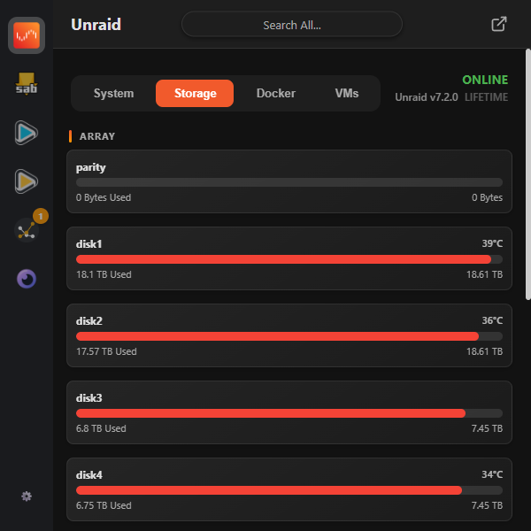
  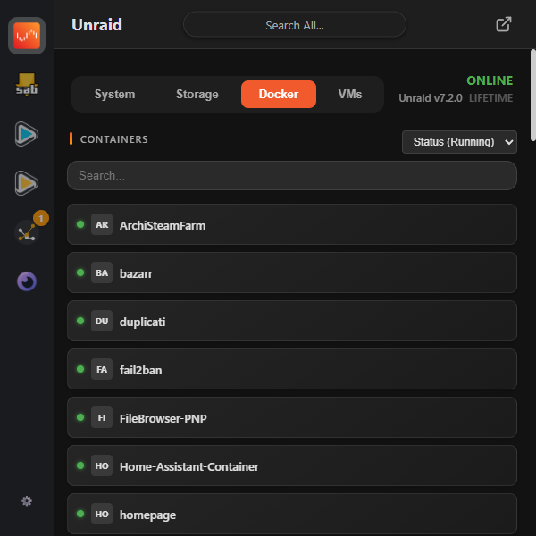
  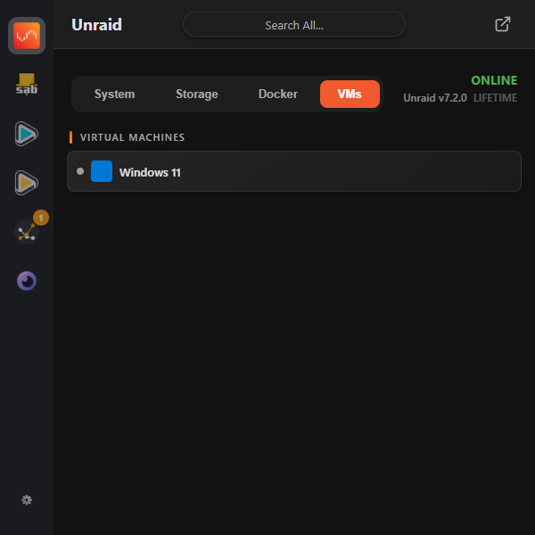

### SABnzbd

  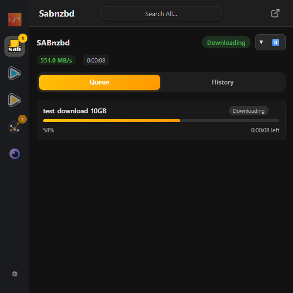
  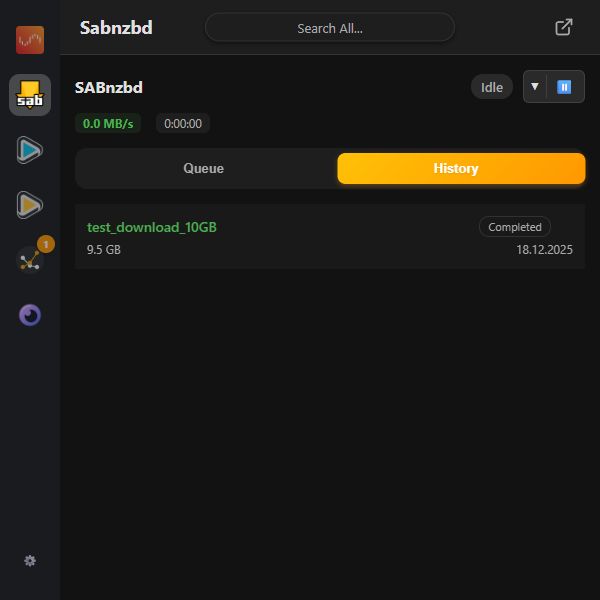

### Sonarr

  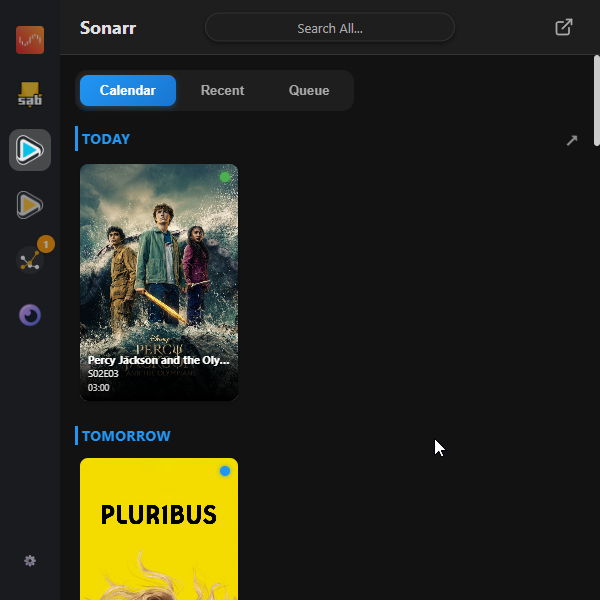
  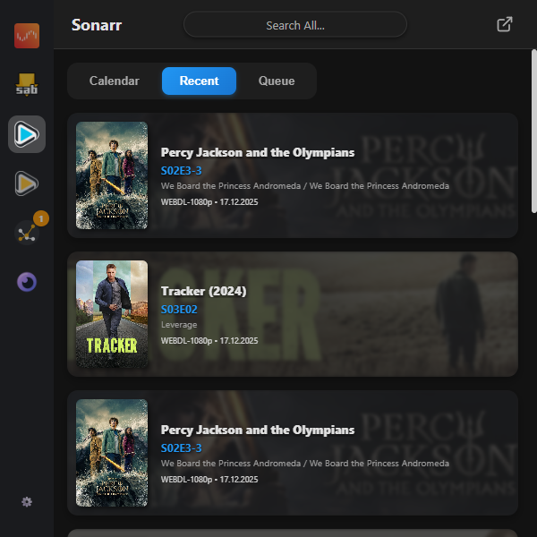

### Radarr

  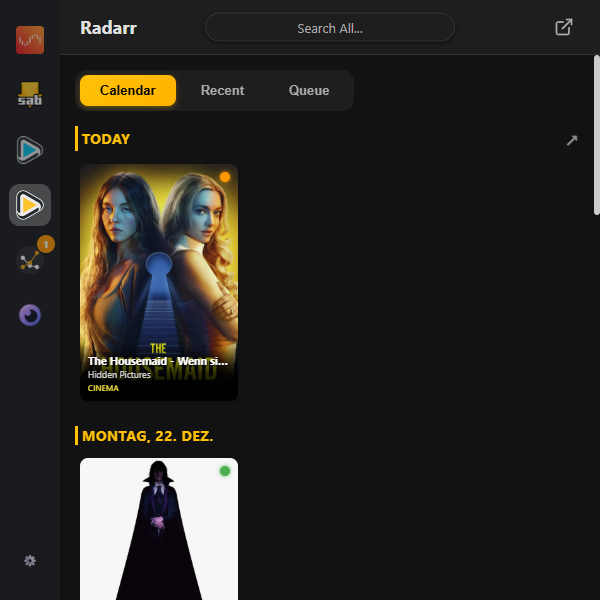
  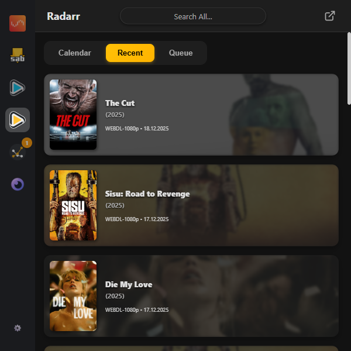

### Tautulli

  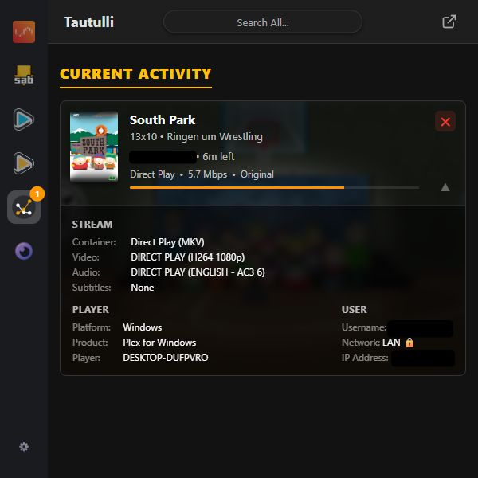

### Overseerr

  
  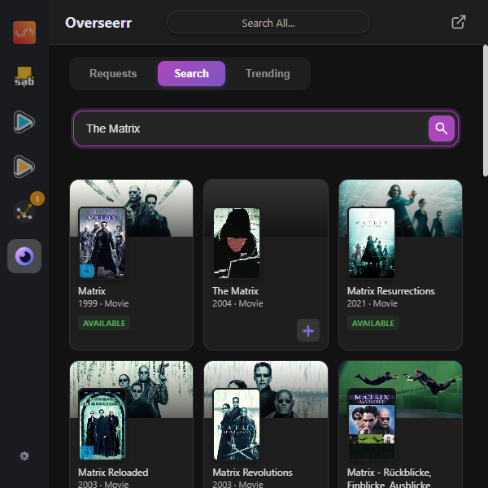
  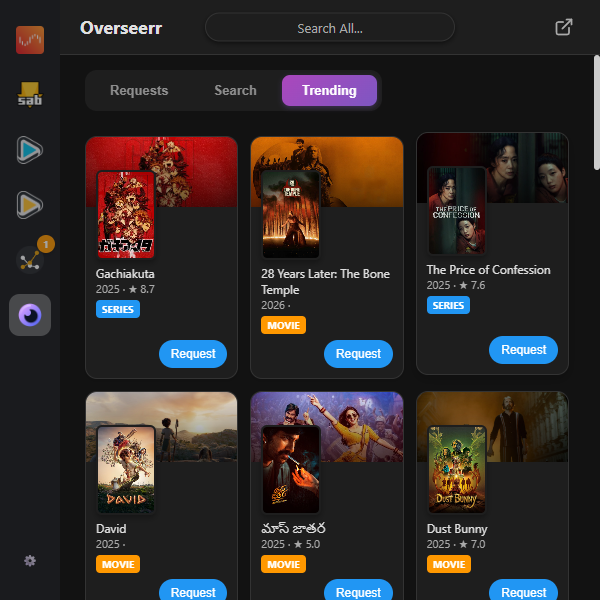

## 🚀 Installation

**Home Server Companion** is officially available on the **Chrome Web Store**!

### Option 1: Install via the Chrome Web Store (Recommended)

1.  Visit the extension page on the **Chrome Web Store**:
    - [https://chromewebstore.google.com/detail/home-server-companion/legakiehaacgpdkmlebkjcijaiegoeld](https://chromewebstore.google.com/detail/home-server-companion/legakiehaacgpdkmlebkjcijaiegoeld)
2.  Click **Add to Chrome** and confirm the installation.
3.  The **Home Server Companion** icon will appear in your toolbar. Pin it for easy access!

### Option 2: Manual Installation (For Developers)

If you wish to test the latest development version or contribute changes:

1.  **Download** the latest release or clone this repository to a folder on your computer.
2.  Open Google Chrome and navigate to `chrome://extensions`.
3.  Enable **Developer mode** by toggling the switch in the top-right corner.
4.  Click the **Load unpacked** button that appears.
5.  Select the **root folder** of this project (the folder containing `manifest.json`).

## ⚙️ Configuration

Once installed, you need to connect your services.

1.  Right-click the extension icon and select **Options**.
2.  Navigate through the tabs to configure each service you use.

| Service         | Setting        | Description                                                                             |
| :-------------- | :------------- | :-------------------------------------------------------------------------------------- |
| **General**     | Service Order  | Drag and drop (or use arrows) to reorder the sidebar. The top item opens by default.    |
| **SABnzbd**     | URL & API Key  | Found in Config -> General / API.                                                       |
| **Sonarr**      | URL & API Key  | Found in Settings -> General.                                                           |
| **Radarr**      | URL & API Key  | Found in Settings -> General.                                                           |
| **Tautulli**    | URL & API Key  | Found in Settings -> Web Interface.                                                     |
| **Overseerr**   | URL & API Key  | Found in Settings -> General.                                                           |
| **Unraid**      | URL            | IP Address or Hostname (e.g., `http://192.168.1.10`).                                   |
|                 | API Key        | Required for advanced control. Generate via "Management Access" settings if available.  |

> **Note**: Ensure your URLs include the protocol (`http://` or `https://`) and port if non-standard (e.g., `:8080`).

## 🛠️ Usage

- **Click** the extension icon to open the dashboard.
- **Sidebar**: Switch between services.
- **Sub-tabs**: Within services like Sonarr/Radarr (Calendar/Queue) or Unraid (Stats/Docker), use the top tabs to switch views.
- **Settings**: Click the gear icon to return to the configuration page.

## Permissions & Privacy

We value your privacy and only request permissions necessary for core functionality:

- **Storage (`storage`)**: Used exclusively to save your configuration (Server URLs, API Keys, View Preferences) locally within your browser profile via the Chrome Sync API. No data is ever sent to external servers or analytics.
- **Optional Host Permissions (`optional_host_permissions`)**: This extension uses _optional host permissions_ to communicate with your self-hosted instances (SABnzbd, Sonarr, etc.). **Permission is only requested when you attempt to connect a specific server URL in the extension options.** Since your servers can be on any local IP address or custom domain, we require this dynamic permission to fetch data from the specific URLs you configure. **We do not access any other websites.**

## 💻 Tech Stack

- **Frontend**: HTML5, CSS3 (Custom Variables), JavaScript (ES6 Modules).
- **Platform**: Chrome Extension Manifest V3.
- **Storage**: Chrome Sync Storage API for settings persistence.

## 🤝 Contributing

Contributions are welcome! If you have a feature request or bug report, please open an issue or submit a pull request.

---

_Built with ❤️ for the HomeLab community._
